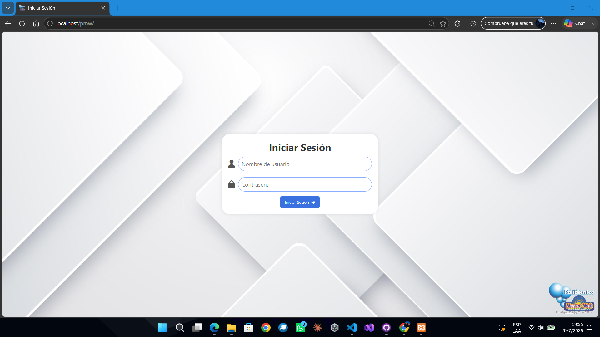
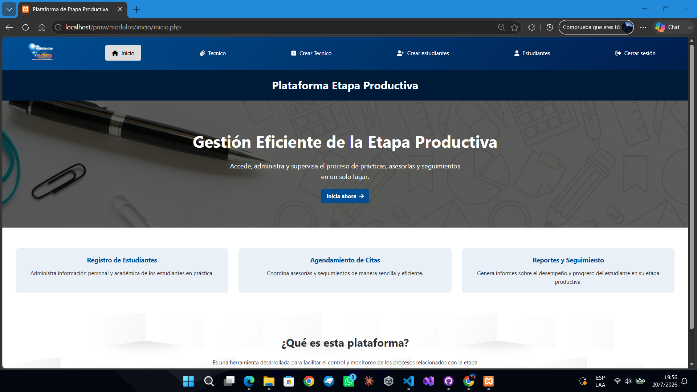
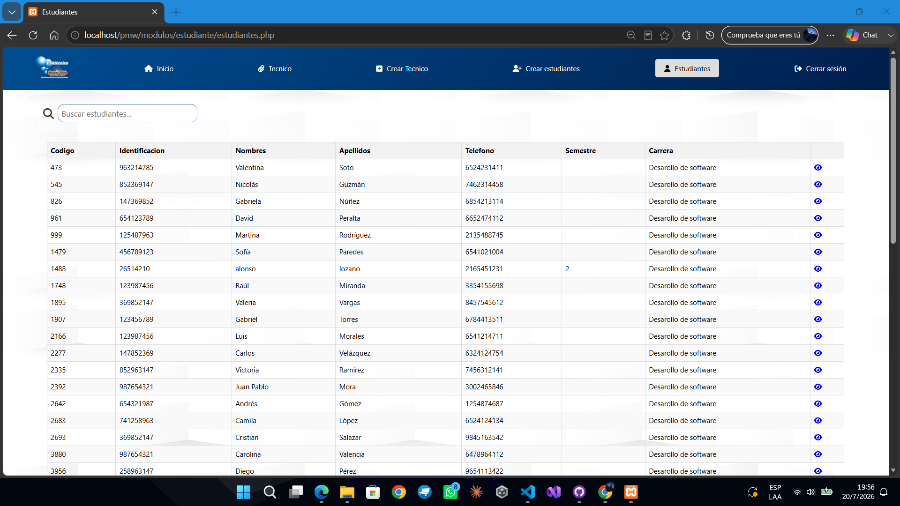
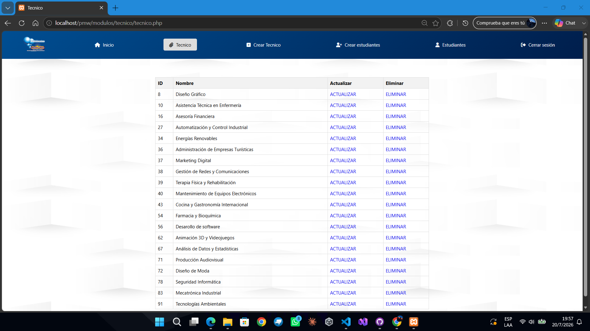
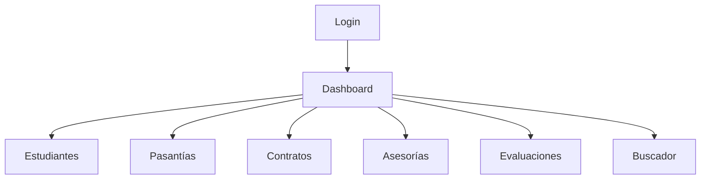

<p align="center">
  
</p>

<h1 align="center">Etapa Productiva</h1>

<p align="center">
<b>Aplicativo Web para la Gestión y Control de la Etapa Productiva de Estudiantes</b>
</p>

<p align="center">
Sistema web desarrollado para administrar estudiantes, pasantías, contratos de aprendizaje, asesorías y evaluaciones desde una única plataforma.
</p>

<p align="center">


</p>

<br>

# 📑 Índice

- 📖 Descripción
- 📦 Contenido del Repositorio
- ✨ Características
- 🛠️ Tecnologías
- 🧩 Módulos
- 🚀 Instalación
- 🔐 Credenciales
- 📸 Capturas
- 📊 Arquitectura
- 📈 Estado
- 💡 Mejoras Futuras
- 👨‍💻 Autor

<br>

# 📖 Descripción

**Etapa Productiva** es una plataforma web desarrollada en **PHP** y **MySQL** para gestionar el proceso de prácticas profesionales de estudiantes. Permite administrar aprendices, controlar modalidades de práctica, registrar asesorías, realizar evaluaciones y consultar la información de forma centralizada.

<br>

# 📦 Contenido del Repositorio

| Archivo | Descripción |
|---------|-------------|
| 📁 `EtapaProductiva/` | Código fuente del sistema |
| 📦 `Instalador_EtapaProductiva.exe` | Instalador automático desarrollado con Inno Setup |
| 📕 `Manual de Instalación.pdf` | Manual de instalación y configuración |
| 📄 `README.md` | Documentación del proyecto |

<br>

# ✨ Características

- 👨‍🎓 Gestión de estudiantes.
- 🏢 Gestión de pasantías.
- 📄 Administración de contratos.
- 📅 Registro de asesorías.
- 📝 Evaluaciones.
- 🔍 Buscador integrado.
- 🗃️ Base de datos MySQL.
- 📦 Instalador automático.

<br>

# 🛠️ Tecnologías

| Categoría | Tecnología |
|-----------|------------|
| Backend | PHP |
| Frontend | HTML5, CSS3, JavaScript |
| Base de Datos | MySQL |
| Servidor | Apache (XAMPP) |
| Instalador | Inno Setup |

<br>

# 🧩 Módulos

### 👨‍🎓 Gestión de Estudiantes
CRUD completo para el registro, consulta, actualización y eliminación de estudiantes.

### 🏢 Pasantías
Administración y seguimiento de las prácticas empresariales.

### 📄 Contratos
Gestión de contratos de aprendizaje.

### 📅 Asesorías
Registro del acompañamiento académico.

### 📝 Evaluaciones
Evaluación del desempeño durante la etapa productiva.

### 🔍 Buscador
Consulta rápida de registros.

<br>

# 🚀 Instalación

## ⚡ Instalación rápida (Recomendada)

Ejecute:

```text
Instalador_EtapaProductiva.exe
```

Incluye:

- Configuración inicial.
- Copia de archivos.
- Preparación del sistema.

## 📘 Manual de instalación

Consulte:

```text
Manual de Instalación.pdf
```

## 👨‍💻 Instalación manual

1. Clonar el repositorio.
2. Importar `config/etapa.sql`.
3. Configurar `config/db.php`.
4. Ejecutar Apache y MySQL.

---

# 🔐 Credenciales

```text
Usuario: AdminPMW
Contraseña: pmw123
```

<br>

# 📸 Capturas

<p align="center">


</p>

<p align="center">


</p>

<br>

# 📊 Arquitectura

```text
Repositorio
│
├── EtapaProductiva/
│   ├── config/
│   ├── css/
│   ├── js/
│   ├── img/
│   └── ...
│
├── Instalador_EtapaProductiva.exe
├── Manual de Instalación.pdf
├── README.md
└── .gitattributes
```



<br>

# 📈 Estado del Proyecto

| Funcionalidad | Estado |
|---------------|:------:|
| Gestión de estudiantes | ✅ |
| Pasantías | ✅ |
| Contratos | ✅ |
| Asesorías | ✅ |
| Evaluaciones | ✅ |
| Instalador | ✅ |
| Manual PDF | ✅ |

🟢 **Proyecto Finalizado**

<br>

# 💡 Mejoras Futuras

- Exportación de reportes PDF.
- Dashboard con estadísticas.
- Sistema de roles y permisos.
- Diseño responsive.

<br>

# 👨‍💻 Autor

**Samuel Durán Cardenas**

Desarrollador en Desarrollo

**Tecnologías favoritas**

- 💻 PHP
- ⚡ JavaScript
- 🗄️ MySQL
- 🎨 HTML & CSS

<br>

<p align="center">
<b>⭐ Si este proyecto fue útil, considera dejar una estrella en el repositorio.</b>
<br><br>
Desarrollado con ❤️ por <b>Samuel Durán</b>
</p>
